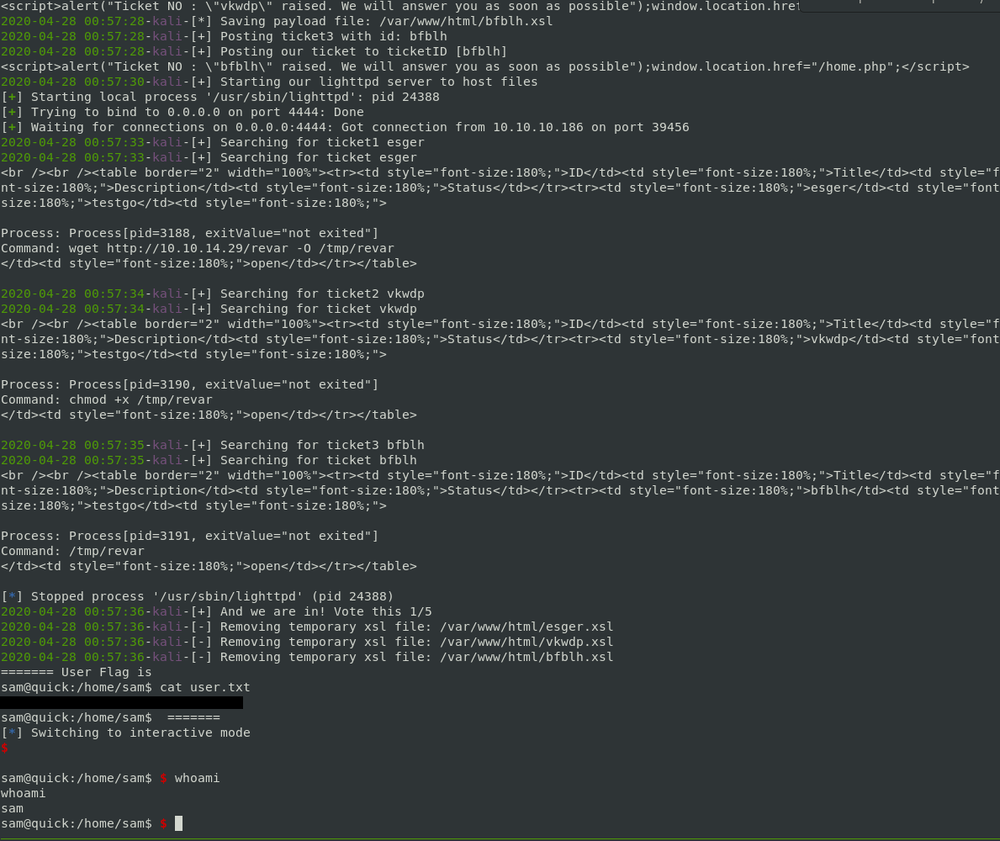
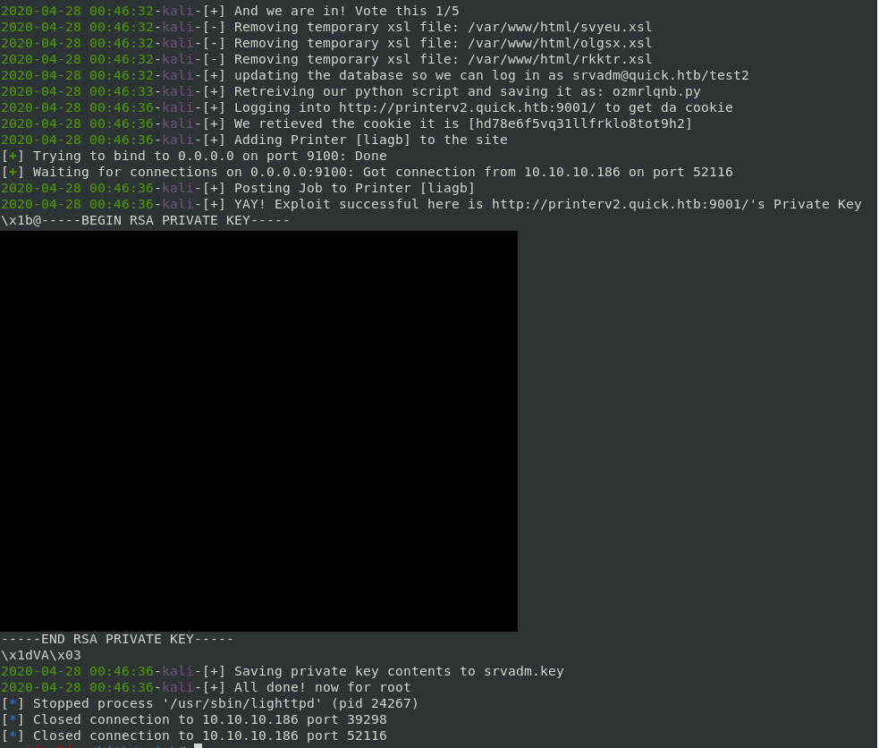
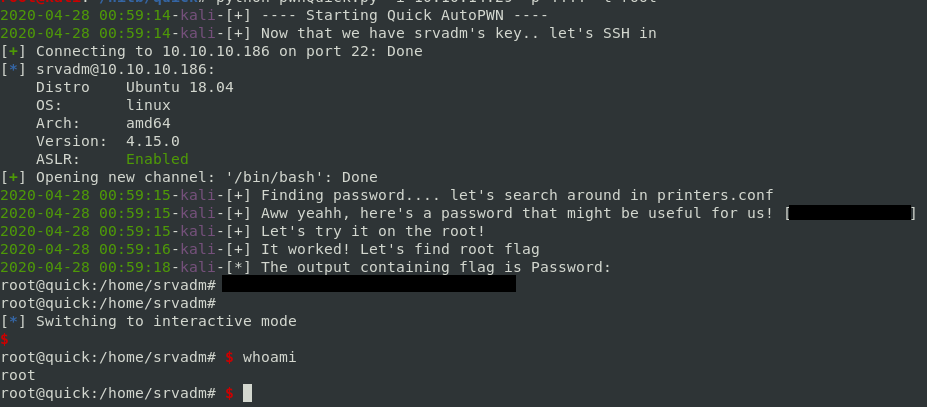

# Automated Script to complete the Quick box

## User Details:    
* We need to compile CURL to support experimental HTTP3/QUIC feature  
* Curl the host for a new set of pages  
* We retrieve a pdf file from the pages
* Page contains a password we can use on the portal
* On the main portal, we are presented with client testimonials
* A bit of guesswork here, but we can try to guess emails in the format \<name>@\<company>.\<region>
* Once we are in the portal we can submit tickets, here's where the automation comes in  

### Automated User
* The server response headers show that the server is using esigate:   
[esigate RCE POC](https://www.gosecure.net/blog/2019/07/03/java-remote-code-execution-potpourri/)
* We have to exploit the functionality by posting tickets with our payload
* It will generate random ticket IDs so that we don't conflict with other user's ticket IDs
* Hosting the corresponding xsl files with malicious payloads by starting the lighthttpd process
* Searching for the tickets to trigger the exploit  
* An issue here was that this process is a bit annoying, and we have to can't launch a reverse shell in one step
* The solution here was to automate this whole flow of requests to the server to gain a reverse shell
* Clean up any files we create, and terminate the lighthttpd process

Running the script with -t user
 

## SrvAdm Details:
* Once we are in as user "sam" we have to somehow elevate to srvadm
* After enumerating we discover that /var/www/printers is interesting
* We also notice that srvadm is in the printers group
* We discover the vhost entry inside /etc/apache configs
* Now we add the vhost in our own /etc/hosts and then hit the site
* We need to log into the site, the credentials are stored in md5() with a salt
* Instead of trying to write a script to find the plaintext, we can update the table since we have access, and override it with a password of our choice
* The website is a web UI to add printers
* Upon looking at the code inside /var/www/printers/ we see that there is a race condition in the logic in the code that can be exploited (chmod and file_get_contents)
* Our objective here is look for the file creation on a new printer job submission, remove the file, and in it's place symlink our target
* Our target here is srvadms id_rsa file. We will remove the temporary file that is created, and replace the file with our symlink to id_rsa
* Upon execution of the job, the printer code will connect back to us and spit out the contents since file_get_contents will read the symlink file, thus reading the target file we are after

### Automation srvadm
* Establishes a reverse shell connection similiar to user
* Invokes mysql query to update the table with a password, "test2"
* Pulls our complementary python script that exploits the flaw in the jobs logic
* Execute the python script in the background as we line up our exploit flow
* Logs into the printer website to obtain a session
* Adds a printer 
* Starts a fake printer listener on port 9001
* Adds a job 
* This should trigger the job logic, and since our python script is running, it will replace the file with a symlink
* The application is then tricked into revealing the private key contained in id_rsa for srvadm
* The code will read the output, and save it to a srvadm.key file using regex to pull the key contents

Running the script with -t srvadm
 
 
## Root Details:
* This is very simple, as the credentials are stored inside a printer config file. Finding it took a while

### Automation root
* With our previously uncovered srvadm.key we will ssh into the host
* Then issue a grep command to look for the password inside the config
* Use a regex to parse out the password
* Url decode the password 
* Issue su to the ssh connection
* cat root.txt 

 Running the script with -t root

