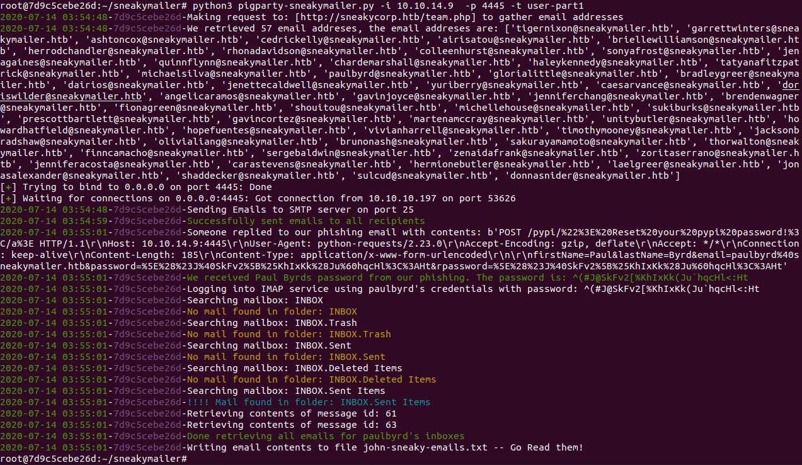
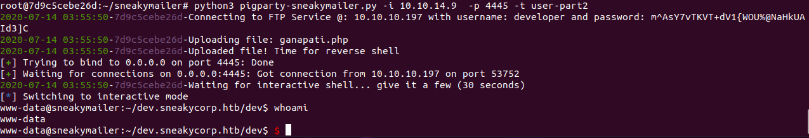
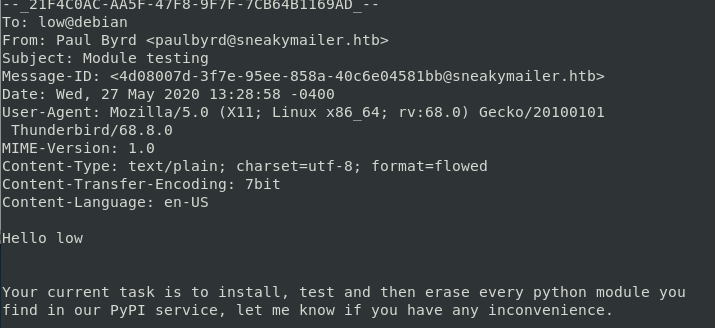
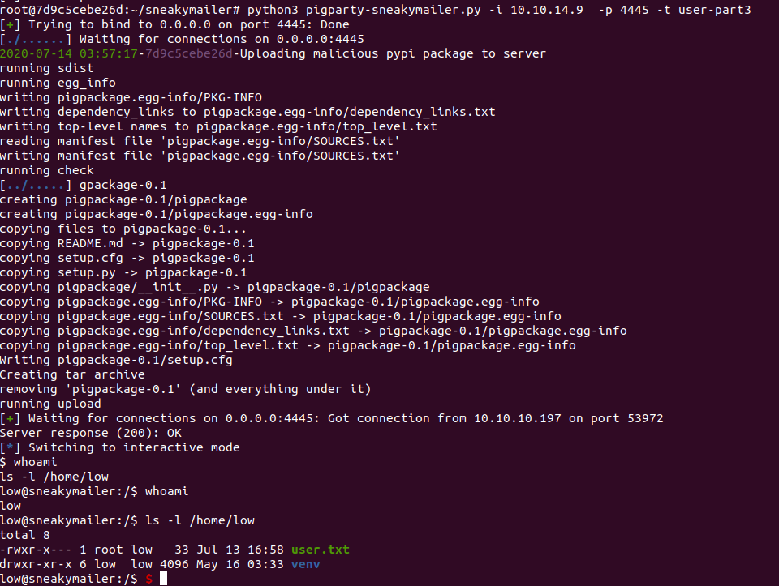
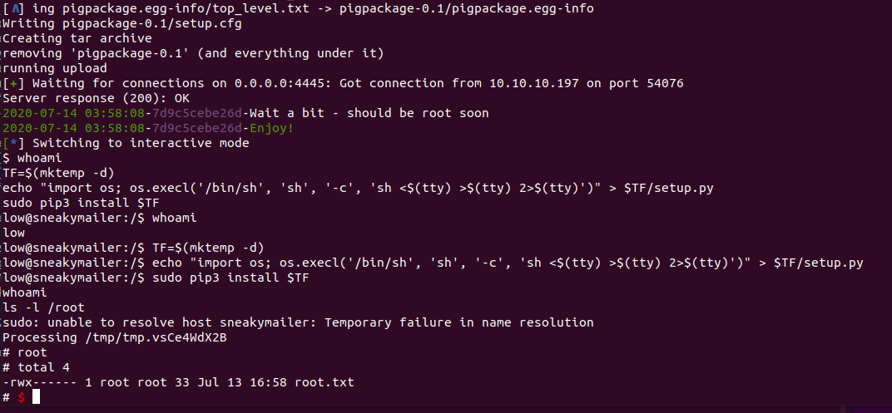

# Automated Script to complete the SneakyMailer Box

TLDR: Box that mainly covers topics:
* Enumeration - Email addresses
* Simple Phishing
* Interacting with IMAP services
* Arbitrary file upload to ftp that serves contents in a development subdomain
* A custom PyPi server
* Submitting a malicious python package to arbitrarily execute code (establish rev shell)
* Privilege escalation from user -> root using sudo pip3

## User Details:    
* Port Scan Reveals
```
Nmap scan report for 10.10.10.197                               
Host is up (0.016s latency).                                    
Not shown: 993 closed ports                                     
PORT     STATE SERVICE                                          
21/tcp   open  ftp                                              
22/tcp   open  ssh                                              
25/tcp   open  smtp                                             
80/tcp   open  http                                             
143/tcp  open  imap                                             
993/tcp  open  imaps                                            
8080/tcp open  http-proxy      

```
* We enumerate the initial set of entry points on the web side
* We add sneakycorp.htb to /etc/hosts
* Also through enumeration we can fuzz a subdomain dev.sneakycorp.htb. Add this to /etc/hosts
```
wfuzz -w ~/SecLists/Discovery/DNS/subdomains-top1million-5000.txt -u http:/10.10.10.197:8080 -H "Host: FUZZ.sneakycorp.htb" --hw 69
```
* Finally at a later step, we also find a subdomain pypi.sneakycorp.htb

### Instructions for Running in Docker (Total Overkill - Read the dockerfile if you want to manually set it up)
```
docker build -t sneakymail:latest .
docker run -it --add-host sneakycorp.htb:10.10.10.197 --add-host dev.sneakycorp.htb:10.10.10.197 --add-host pypi.sneakycorp.htb:10.10.10.197 -p 4445:4445  sneakymail:latest /bin/ash
cd /root/sneakymailer
python3 pigparty-sneakymailer.py -i  10.10.14.9 -p 4445 -t user-part1

*Ensure ports match since we're forwarding from host -> container. In this case we're using port 4445
```

### Automated User:  Part 1 - Email scraping, Phishing, and Downloading Emails
Running the script for user-part1
```
python3 pigparty-sneakymailer.py -i  10.10.14.9  -p 4445 -t user-part1
```


* The automated script will fetch emails from the website
* The script will then connect to the SMTP service, and send a phishing email to all potential recipients (i.e. the email list)
* A listener will await any clicks to a link supplied in the phishing email. The link points to our server.
* The box is designed such that the user (must be a really silly individual) who clicks the link will submit a credential
* The script will parse out the credential
* Then it will log into the IMAP service using the credential
* Once logged into IMAP the script will use IMAPClient libs to pull down all email from all inboxes
* At the conclusion of part 1, the emails are saved to a file: john-sneaky-emails.txt

  
### Automated User:  Part 2  - Interacting with FTP and uploading files, then obtaining reverse shell
Running the script for user-part2
```
python3 pigparty-sneakymailer.py -i  10.10.14.9  -p 4445 -t user-part2
```

* A credential was contained within one of the emails
* The script will use this credential to log into FTP 
* The script will navigate to the /dev directory. The dev directory contains contents from dev.sneakycorp.htb
* Upload a PHP reverse shell to the /dev directory
* Set up a listener
* Make a request to our uploaded PHP file
* Establish a shell as www-data
* In interactive mode, the user can navigate to the  /var/www directory and see a new subdomain pypi.sneakycorp.htb
* There is an .htaccess file containing credentials that one can crack. It will become useful later.

### Automated User:  Part 3 - Uploading a malicious PyPi Package



Looks like the user, "low" is tasked with anything submitted to the PyPi service
Also in addition, from enumeration in part2, we see 
* Pypi-service is running on port 5000. A user is required to authenticate to it using credentials contained within .htpasswd
* One can update PyPi packages on the service
```
pypi       707     1  0 10:36 ?        Ss     0:02 /var/www/pypi.sneakycorp.htb/venv/bin/python3 /var/www/pypi.sneakycorp.htb/venv/bin/pypi-server 
-i 127.0.0.1 -p 5000 -a update,download,list -P /var/www/pypi.sneakycorp.htb/.htpasswd --disable-fallback -o /var/www/pypi.sneakycorp.htb/packages

```
Running the script for user-part3
```
python3 pigparty-sneakymailer.py -i  10.10.14.9  -p 4445 -t user-part3
```

* We construct a malicious PyPi package contained in the directory mypackage. 
 The [Malicious PyPi Sample]  (https://github.com/rsc-dev/pypi_malware/blob/master/malware/openvc/openvc-1.0.0/setup.py) provides us with how we can construct a doo doo package.
* There is also a .pypirc file that we have to include in our home directory
* The script will upload a malicious pypi package to the pypi.sneakycorp.htb endpoint. The payload is a reverse shell contained in an install directive
* A service running on the server emulates actions taken by the user, "low". This service will install arbitrary packages in the PyPi  repo (Employee Low needs to stand in a time-out corner!!)
* We set up a listener and wait the shell. We will have a connected as user, "low"
* The script upgrades to a TTY shell, and also displays the location of user.txt

## Automated Root : Sudo stuff
Running the script for root
```
python3 pigparty-sneakymailer.py -i  10.10.14.9  -p 4445 -t root
```


* Similar to the step before, the script will establish a reverse shell as low
* Issuing sudo -l reveals that we can run pip3
* The script will issue commands in a TTY shell
```
TF=$(mktemp -d)    
echo "import os; os.execl('/bin/sh', 'sh', '-c', 'sh <$(tty) >$(tty) 2>$(tty)')" > $TF/setup.py 
sudo pip3 install $TF
```
* Then display the location of root.txt


