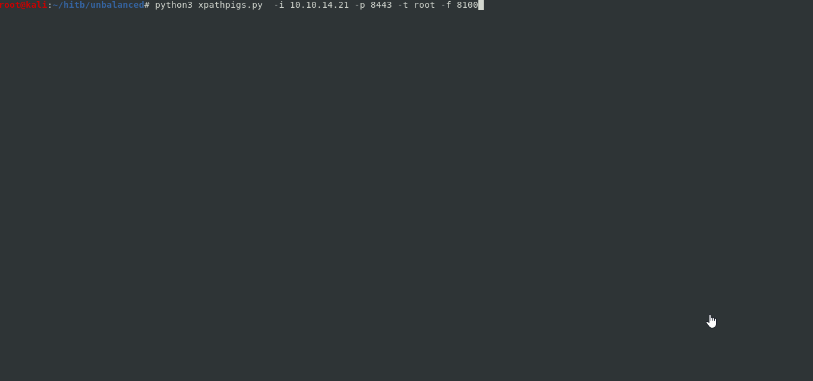

# Automated Script to complete the Unbalanced box

## User Details:    
* We enumerate the initial set of entry points:
```
Nmap scan report for 10.10.10.200
Host is up (0.095s latency).
Not shown: 997 closed ports
PORT     STATE SERVICE
22/tcp   open  ssh
873/tcp  open  rsync
3128/tcp open  squid-http
```
* port 873 is open
* rsync --list-only rsync://10.10.10.200:873 shows us a dir named conf_backups
* Pull files using: rsync -r rsync://10.10.10.200:873/conf_backups .
* Use encfs2john.py to create a crackable hash for the backups
* After retrieving backup password, we can decrypt it with encfs
* Inside squid.conf we find credentials:
```
cachemgr_passwd Thah$Sh1 menu pconn mem diskd fqdncache filedescriptors objects vm_objects counters 5min 60min
```  
* We can talk to squid proxy on 3128 using squidclient
* Command displays manager options in squidclient:
```
squidclient -w 'Thah$Sh1' -h intranet.unbalanced.htb mgr:menu 
```
* One interesting entry is in mgr:fqdncache:
```
Address                                       Flg TTL Cnt Hostnames
127.0.1.1                                       H -001   2 unbalanced.htb unbalanced
::1                                             H -001   3 localhost ip6-localhost ip6-loopback
172.31.179.2                                    H -001   1 intranet-host2.unbalanced.htb
172.31.179.3                                    H -001   1 intranet-host3.unbalanced.htb
10.10.10.200                                   N  -2826   0
127.0.0.1                                       H -001   1 localhost
172.17.0.1                                      H -001   1 intranet.unbalanced.htb
ff02::1                                         H -001   1 ip6-allnodes
ff02::2                                         H -001   1 ip6-allrouters
```
* Create entry in /etc/hosts for intranet.unbalanced.htb 
* Set upstream proxy to intranet.unbalanced.htb port 3128
* Navigate to intranet.unbalanced.htb to view a company page representing internal website

* Upon entering an invalid user name and password, we do not receive any error messages from the application
* Upon viewing fqdncache we infer the layout is as follows:

* We can verify this by attempting to navigate to the unlisted instance of the application at 172.31.179.1

* The main difference between this host and the other two that are listed in the fqdncache is an error message

* This tips us off on focusing on the minor difference between the applications


### Attack Path
* Site is vulnerable to XPath injection. A query such as:
```
Username=sarah&Password=test%27+or+'a'%3d'a
```
* Will display results for all users
* The constraint here is that there is more data in the XML file that we need, the password specifically
* We therefore have a blind injection point and have to first determine the length of each users password
```
Username=rita'+and+string-length(Password/text())%3d11+or+'a'%3d'a&Password=s
```
* Then we have to iterate through 0..length, and iterate through every character
* For example: If an error message is not displayed for length = 10, position = 0, and char = 'c', then we know 'c' is the first character
* Then we would restart at postition 1 and repeat the same steps until we discover the next character in the password


### Automated User
* The automated script uncover the passwords for all users through the blind XPath injection point 
* First it will determine the length of the passwords for each user using
```
payload = "%s' and string-length(Password/text())>%i or 'a'='a" % (username, daLength)
```
* Then it will iterate through string.printable and observe the corresponding response message to determine if the correct character in the password was found
```
payload = "%s' and substring(Password/text(),%i,1)='%s' or 'a'='a" % (user,length,p)
```
* It will then iterate through the username/password list and attempt to SSH into the host
* Once successful it will enter interactive mode

Running the script with -t user
 

 
## Root Details:
* After we gain a user shell, we see that there is a service bound to 8080. Netstat was not on the host so we use 
/proc/net/tcp
* Port forward 8080 to ourselves so we can access the web UID
* Running pihole - based on enumeration we can try https://frichetten.com/blog/cve-2020-11108-pihole-rce/ 
* Executing through the exploit with modifications grants us root


### Automation root
* SSH into the box using the password discovered in the user steps
* Port forward 8080 to a local port specified in the script 
* Set up series of listener threads to serve content at each phase, as illustrated in the blog post above
* Once we land on the box it will perform the last step to SSH into root using creds found after gaining RCE from the pihole exploit

Running the script with -t root

